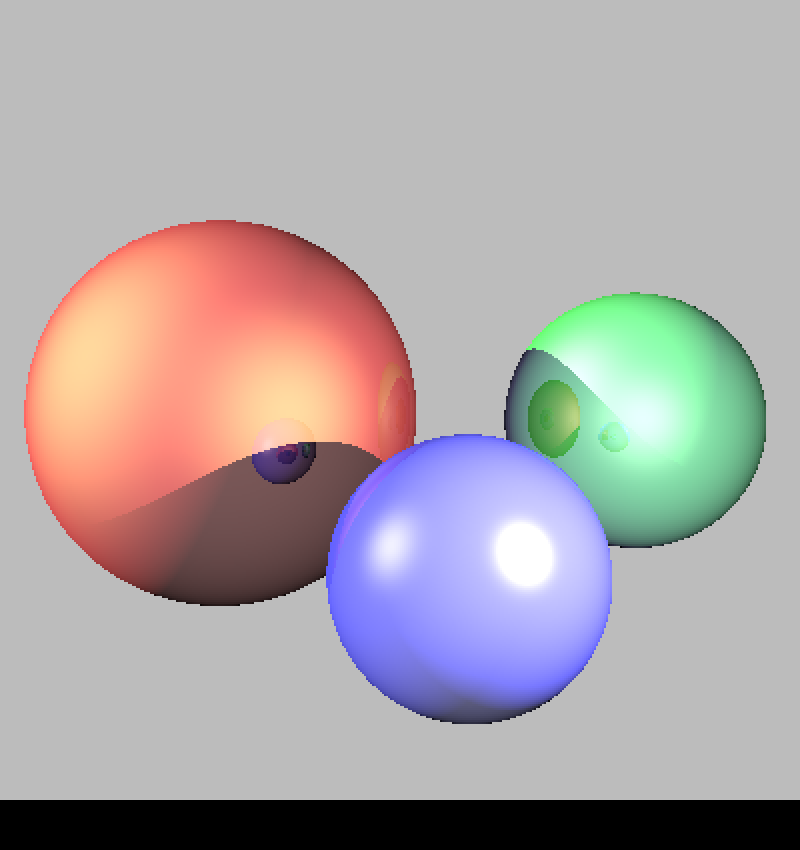

Bastien Soucasse – Monde 3D

# TD 1 – 25 janvier 2022

## Rayons primaires

### Génération de rayon

La génération de rayon a été implémentée grâce à la formule vue en cours, ainsi que l’intersection avec la scène qui va itérer la vérification d’intersection sur chaque `shape` de la scène.

### Intersection avec les sphères

La première intersection implémentée est celle avec une sphère.

La première image résultant de cette implémentation est une image complètement grise.

La scène ayant un arrière-plan gris `rgb(.6, .6, .6)`, on en déduit qu’il n’affichait que l’arrière-plan de la scène, et donc que l’intersection n’était pas fonctionnelle.

J’ai donc affiché, dans `Scene::intersect()`, si un rayon était en intersection avec une shape (à l’aide d’un affichage dans la console dans le `if`) et aucune sortie n’était affichée. La conlusion de ceci fût que la fonction `Sphere::intersect()` était la source du problème.

Afin de vérifier les calculs, j’ai décidé d’afficher (dans `Sphere::intersect()`) tous les deltas non négatifs. Et encore une fois, aucune sortie ne c’est affichée. Le problème vient donc du calcul du discriminant.

En se demandant où le calcul pouvait être faux, j’ai été emmené à tester les valeurs de la direction du rayon. Celle-ci était à chaque fois la même pour chaque pixel de l’image, ce qui n’est évidemment pas normal. J’ai donc compris que l’erreur venait du calcul de la direction du rayon dans `render()`.

Après recherche, je me suis rendu compte que mes `i` et `j`, ainsi que `width` et `height`, étaient tous de type `int`. Or en C++, le type du résultat d’une division d’un `int` par un `int` sera toujours un `int`. La division est donc approximative alors qu’elle devrait être très précise et la direction est calculée sur cette approximation. En explicitant `i` et `j` comme des `float`, la division devient donc précise et la direction calculée est bien la bonne.

L’image affichée lors du deuxième test est bien la bonne.

### Intersection avec les plans

Une fois les intersections avec les plans implémentés, le premier test témoigne d’un bug. L’intersection avec le plan est priorisée alors qu’il est censé être derrière les sphères.

Après plusieurs recherches, l’erreur trouvée était en réalité un oubli dans une formule. En effet, il manquait une partie du calcul des racines de l’équation du rayon lors de l’intersection avec une sphère (le dénominateur concrètement). Il s’agit donc d’une erreur bête. Les formules donnaient des résultats « suffisemment corrects » pour rendre des images cohérentes précédemment. Mais cette fois, l’erreur fût repérée et corrigée. Le problème est alors en effet résolu.

## Éclairage

### Normales

Après implémentation de la visualisation des normales, il ressort du test sur la scène `troisSpheres.scn` une image cohérente et en adéquation avec celle présentée sur le sujet.

### Éclairage direct

L’éclairage a été implémenté sans difficulté particulière malgré une implémentation qui fût longue et parfois difficile au niveau des calculs. Mais les résultats sont très satisfaisants et cohérents. Il « suffisait » de suivre les formules du cours et de les implémenter, c’etait surtout fastidieux.

- Pour la scène `troisSpheres.scn` :

- Pour la scène `phong.scn` :

## Rayons secondaires

### Ombres portées

La génération des ombres n’a pas non plus posé de problèmes particuliers. Le test sur la scène `troisSpheres.scn` donnent des résultats corrects, en accord avec ceux attendus.

### Rebonds multiples

Les premiers tests on été réalisés sur la scène `troisSpheres.scn`. Ici, il y a eu plus de difficultés pour obtenir un résultat satisfaisant. En effet, après la première implémentation, il n’y avait absolument aucune différence avec la version de la scène affichée avec l’intégrateur `whitted` avec les ombres portées.

Le problème était en réalité tout bête, mais la recherche de celui-ci fût longue et fastidieuse, pour trouver un final grâce à une épiphanie. Il s’agissait en réalisé du réfléchi du vecteur direction du rayon primaire par rapport à la normale de la surface intersectée qui n’avait pas été inversé, et partait donc dans le mauvais sens malgré une direction correcte. En corrigeant cette erreur, je ne suis malheureusement pas arrivé à un résultat adéquat. L’image en sortie était en effet très bruitées sur les formes affichées.

Après maintes recherches puis relecture du cours, je me suis rendu compte qu’il fallait légèrement décaler le nouveau rayon (rebond) de la surface (en suivant la normale) pour éviter toute intersection due à des problèmes d’imprécisions de calculs. En appliquant ce correctif, le bruit est alors disparu. Cependant, l’image finale n’était toujours pas satisfaisante. Les ombres et couleurs étaient toutes éclaircies.

J’ai passé beaucoup de temps à tenter de débuguer ce problème là, au point même d’abandonner après plusieurs heures passées à chercher en vain, à plusieurs reprises. J’ai également testé le code sur les autres images données en guise de comparaison dans le sujet.

- Pour la scène `phong.scn` :

On retrouve ici une image très similaire à première vue, voire identique à celle du sujet. Le problème ne semble donc pas présent ici.

- Pour la scène `petanque.scn` :

Cette image témoigne cependant d’un très gros bug qui rend le résultat complètement incensé. Malgré ce dernier test, aucune solution ne fût trouvée dans un premier temps.

Ce n’est que bien plus tard que le problème fût détecté. Les rayons primaires ne trouvant pas d’intersection affichent une couleur d’arrière plan de la scène. Cependant il en était de même pour les rayons rebondis, alors que ceux-ci ne devraient pas prendre en compte l’arrière plan de la scène car sinon ils éclaircissent effectivement la couleur retournée (sauf dans l’unique cas d’un arrière plan noir, d’où la scène `phong.scn` sans problème en sortie).

En retravaillant cette partie du code, on obtient finalement une image plus logique pour `troisSpheres.scn`.

Cependant le problème n’était pour autant pas résolu pour `petanque.scn`. Il a alors fallu continuer les recherches.

Ce n’est que bien plus tard, après de nombreux tests et de grosses réflexions, que le dernier problème s’exposa à moi. La condition vérifiant un rebond intersectant un objet entre lui même et une source lumineuse, qui plus est en amont de la source lumineuse dans le cas de lumière ponctuelle, était erronnée. Après correction, la dernière image posant problème apparût alors comme attendu.

