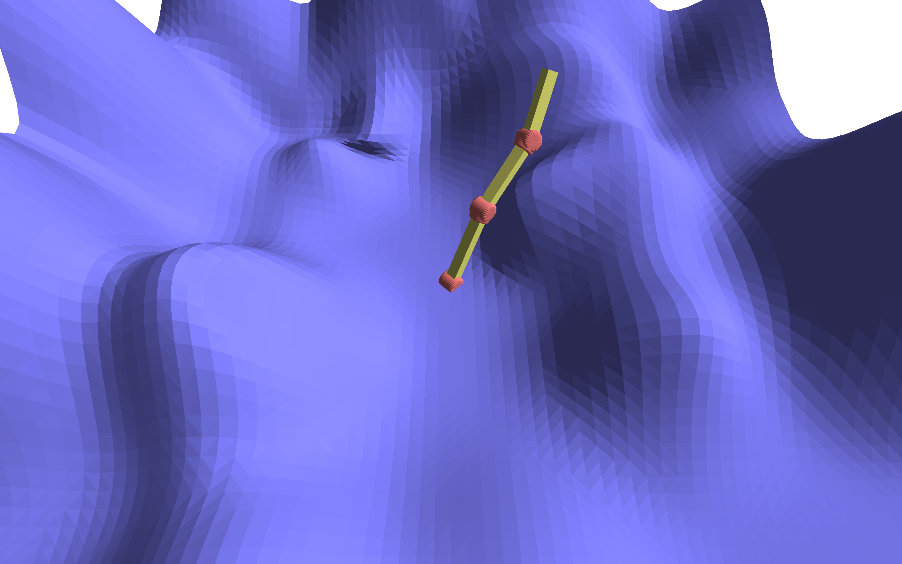
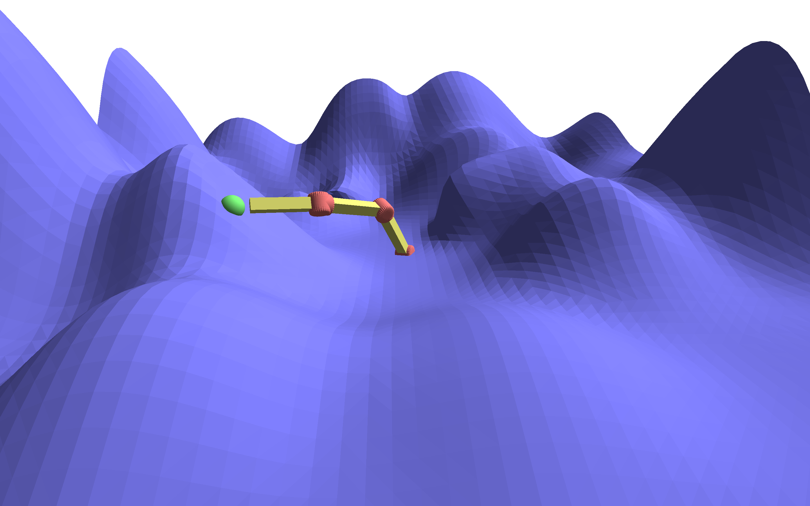
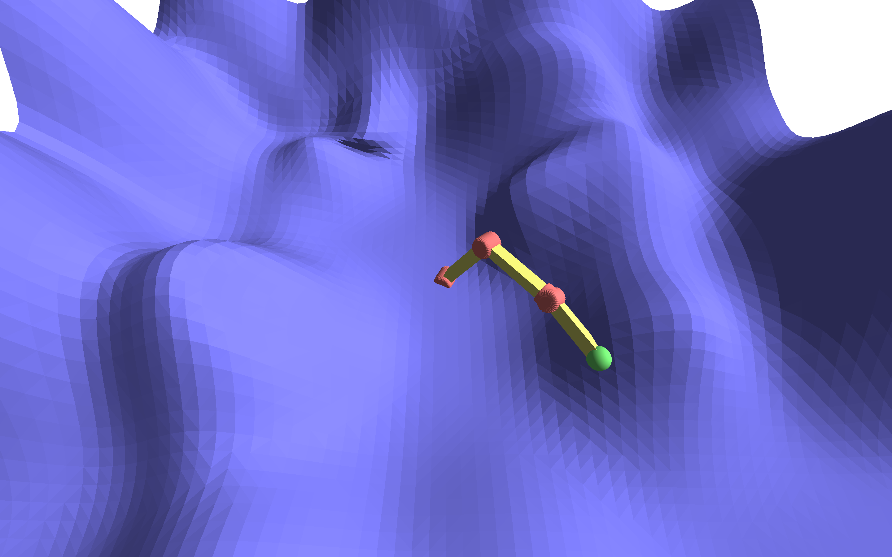
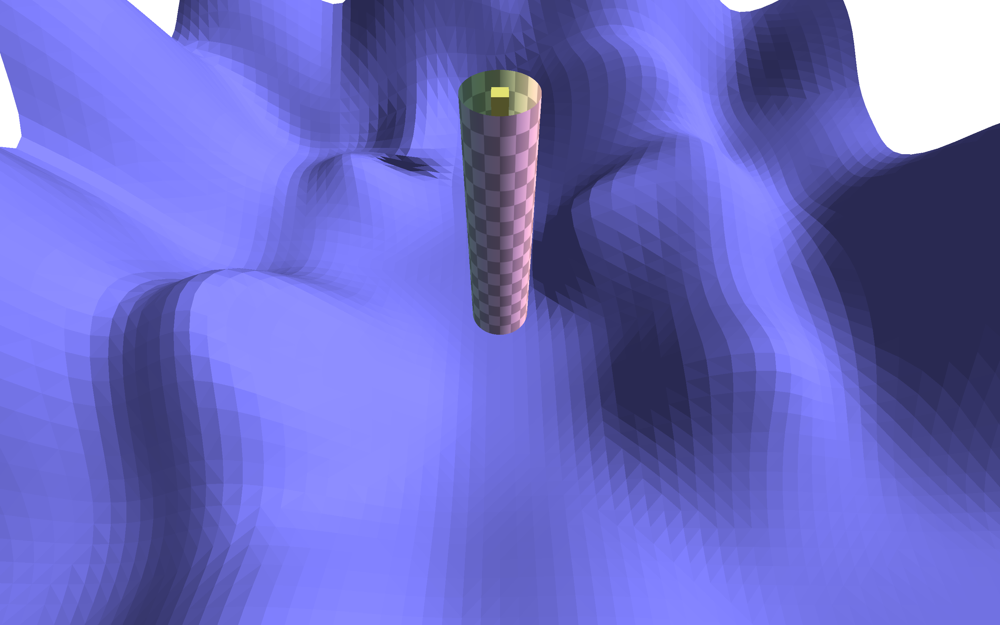
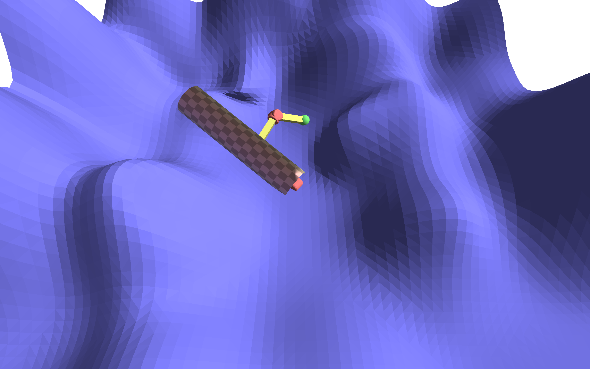
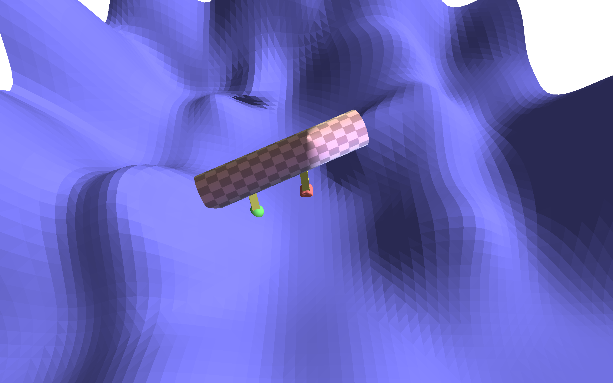
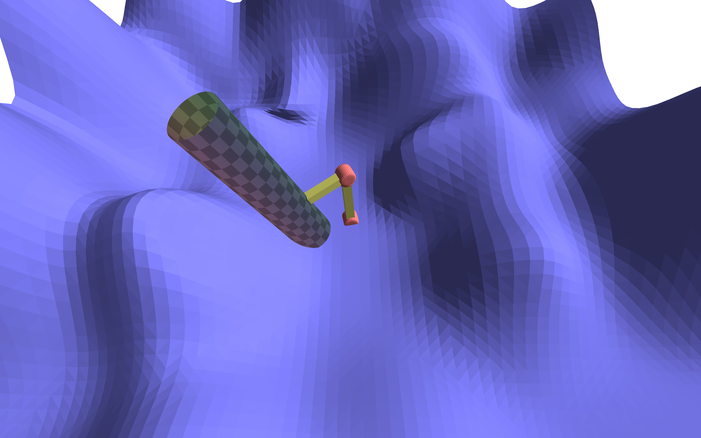
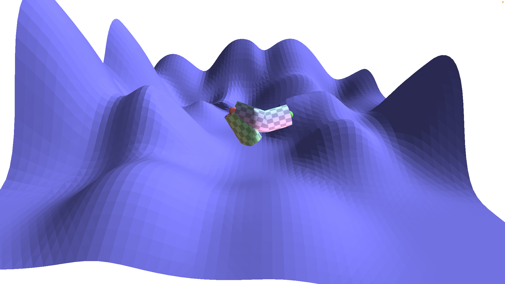
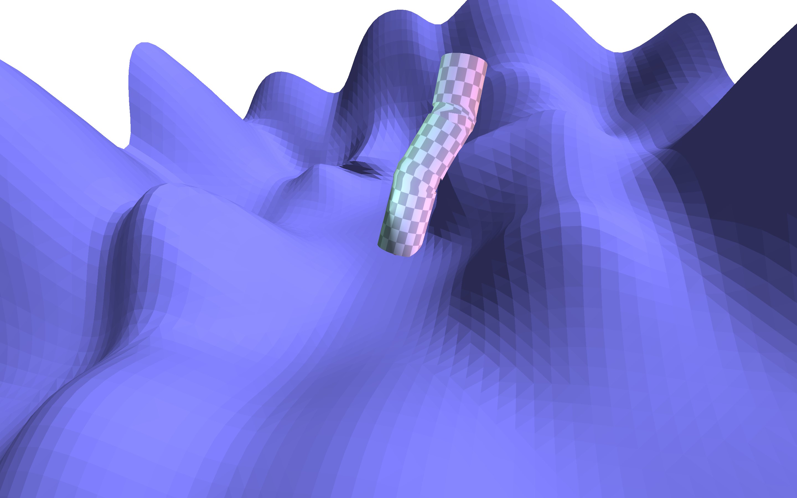

# TD10 — Cinématique inverse et skinning

## Rendu du bras articulé

Le premier problème fût un mauvais placement des joints et segments.

Les objets étaient en fait dessinés au mauvais moments et des rotations ou translations suivantes étaient appliquées dors et déjà. La version modifiée correspond à l'attente.

## Cinématique inverse

Cette partie fût assez difficile à implémenter. Beaucoup de temps a été dédié à la compréhension et au code sans possibilité de tester, malgré l'aspect relativement « court » de cette implémentation.

La première version acceptable témoigne de trois problèmes majeurs. Le premier est un mouvement sacadé et avec un aspect aléatoire (similaire à une crise d'épilepsie). Le deuxième, quant à lui visible sur la capture d'écran, est un mauvais calcul des angles de rotation impliquant une non atteinte du point de destination. Enfin, le troisième, qui découle des deux premiers, provient du fait que les angles se  « cassent » et les rotations deviennent de moins en moins proches de celles attendues.

Le problème de calcul des angles de rotation venait du fait que les matrices de rotations et celle de translation n'étaient pas toujours calculées aux bons endroits ou dans le bon ordre. Quant aux problèmes de linéarité du mouvement, ils étaient dûs à une mauvaise utilisation de la méthode `VectorXf::Map()`. Effectivement après correction, le bras atteint le point et de manière linéaire (sans bug de position durant le mouvement).

## Skinning

Tout d'abord, il a fallu créer et initialiser un nouveau set de shaders pour la peau du bras en s'inspirant du TD 8. Il a également fallu modifier le fichier `CMakeLists.txt` pour utiliser `SOIL` nécessaire au chargement des textures.

En faisant passer la longeur du bras articulé (et en faisant en sorte que ce bras articulé soit initialisé tout droit, c'est-à-dire en mettant ses angles de rotation à 0).

Il est alors possible de calculer `M = T * B.inverse()` pour chaque rotule, et de passer ces matrices au _Vertex Shader_ afin d'appliquer les rotations de chaque segment du bras.

Pour choisir quelle matrice utiliser selon le segment, il suffit de comparer la position actuelle sur l'axe _z_ avec la longueur des segments. On peut ainsi trouver sur quel segment la position se trouve.

Pour mettre en place un skinning linéaire, on peut calculer un poids aux matrices `M[i]` appliquées aux points proches des articulations (relatif à la distance euclidienne) afin de modifier de manière linéaire l'angle de rotation autour des articulations.

