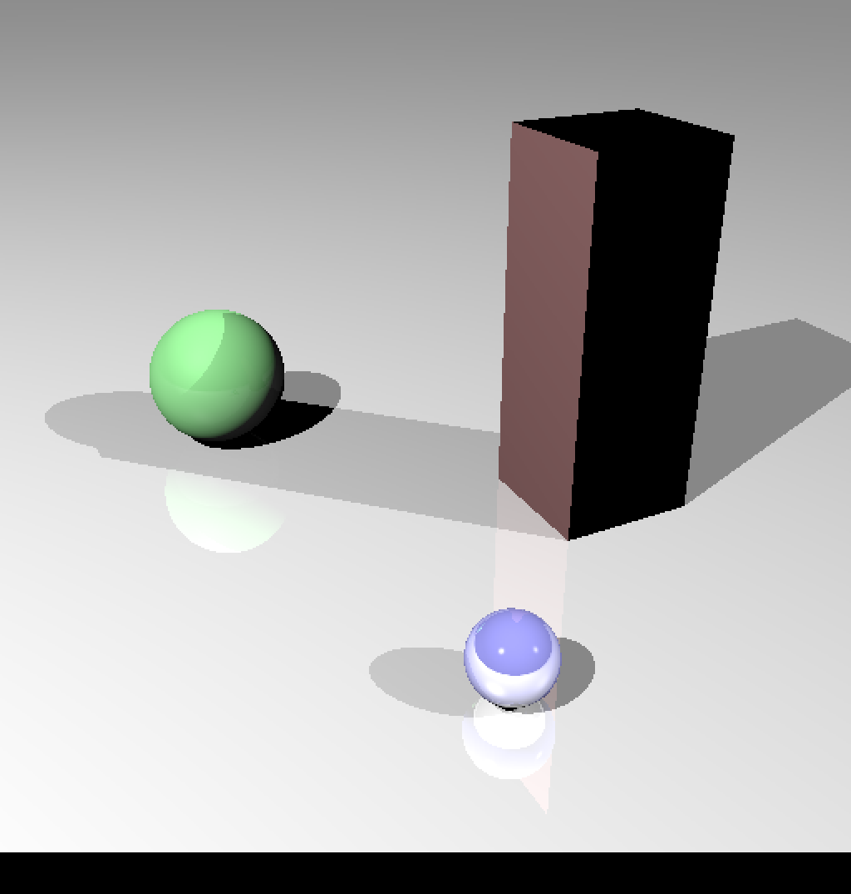
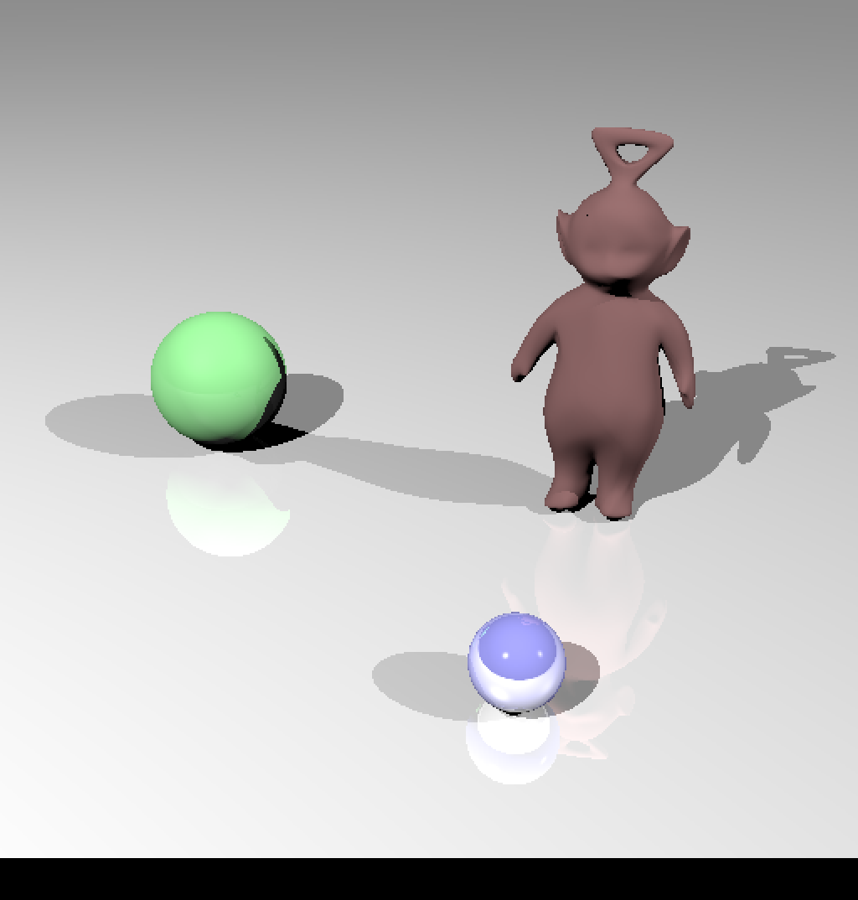

Bastien Soucasse – Mondes 3D

# TD 2 – 1er février 2022

## Calcul d’intersection

Par défaut, le programme compile correctement et affiche bien la boîte englobante de l'objet.

Après implémentation de l’intersection des faces, on obtient une image cohérente affichant chaque face triangulaire de l’objet.

En calculant cette fois les normales par sommets au lieu des normales par faces, on obtient un rendu plus _smooth_.

Cependant on se rend vite compte que le temps de calcul est très important lorsque l'on a un objet avec beaucoup de faces, ici 12576 au lieu de 503 précédemment.

Effectivement, le temps de _raytracing_ est passé de 1.57s à 25.48s.

## BVH
