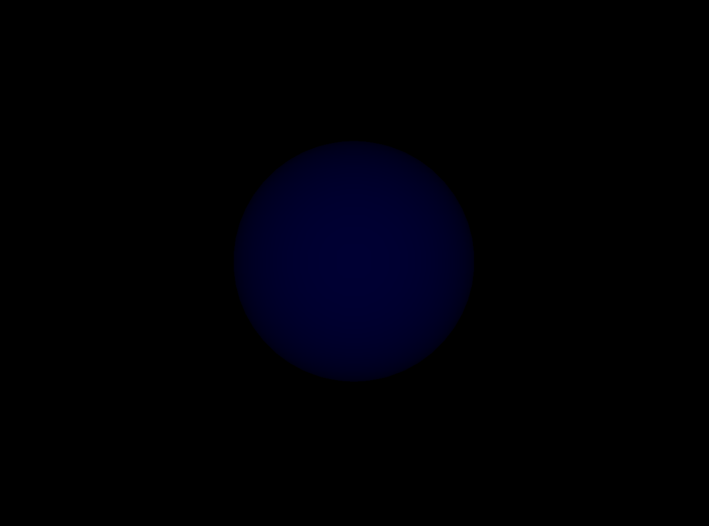

# Éclairage et normales - TD 5

Bastien Soucasse – Mondes 3D

## 1. Calcul de l'éclairage

L'implémentation du calcul de l'éclairage dans le _vertex shader_ a tout d'abord été réalisée, ainsi qu'une adaptation du code.

Concrètement, une lumière directionnelle de couleur blanche `(1, 1, 1)` a été ajoutée avec une direction de `(1, 0, 1)` choisie arbitrairement.

Notons également qu'il ne fût pas évident d'implémenter la fonction `blinn()` du shader ne sachant pas la nécessité de la couleur ambiante. On a choisit une valeur arbitraire du terme ambiant de 0.2 pour avoir une légère couleur de fond (notamment pour les parties non éclairées).

Il fût alors possible de remplacer provsioirement la couleur du sommet par une couleur calculée à partir d'une base noire et de la composante _z_ de la normale. On obtient ainsi une sphère visiblement bleue (en effet les sommets visibles sont orientées vers la caméra).

Pour la sphère éclairée via le _vertex shader_ (avec vue des normales sur l'axe _z_) : 

Pour la sphère éclairée via le _vertex shader_ (sans affichage des normales) : 

Pour le singe éclairé via le _vertex shader_ : 

En passant à un éclairage calculé par le _fragment shader_, on constate effectivement une amélioration des zones éclairées.

Pour la sphère éclairée via le _fragment shader_ (avec vue des normales sur l'axe _z_) : 

Pour la sphère éclairée via le _fragment shader_ (sans affichage des normales) : 

Pour le singe éclairé via le _fragment shader_ : 

On peut alors décomposer l'éclairage de l'objet.

Pour la sphère (avec vue des normales sur l'axe _z_) :\
Éclairage ambiant : 
Éclairage diffus : 
Éclairage spéculaire : 

Pour la sphère (sans affichage des normales) :\
Éclairage ambiant : 
Éclairage diffus : 
Éclairage spéculaire : 

Pour le singe :\
Éclairage ambiant : 
Éclairage diffus : 
Éclairage spéculaire : 

## 2. Calcul des normales

Après une implémentation du calcul des normales qui paraissait correct, le test sur le fichier `lemming.off` montrait que les normales n'étaient pas calculées correctement. Aucune lumière n'apparaissait, seulement la couleur ambiante. 

Après recherches, il s'avère qu'en récupérant les sommets avec `Vertex vertex = mVertices.at(vertex_index)`, on ne récupère qu'une copie du sommet en mémoire. Si on applique une nouvelle normale à celui-ci, celle de l'objet originel ne sera pas modifiée, d'où l'absence de lumière. En remplaçant par une référence (`Vertex& vertex = mVertices.at(vertex_index)`) le problème fût complètement réglé. 

Pour y voir plus clair, voici la version zoomée. 

N.B. : Il n'a pas été évident de savoir vraiment où ajouter l'appel à `computeNormal()`. En réfléchissant, le meilleur moment serait après chargement du fichier étant donné que les normales ne changent pas l'objet n'évoluant pas. Cependant, dans le cas d'un fichier _obj_ tel que `sphere.obj` les normales calculées semblent moins précisent que celles utilisées de base. 

On en déduit qu'un objet de type _obj_ a ses normales précalculées. On ne le modifie pas dans ce cas là.
