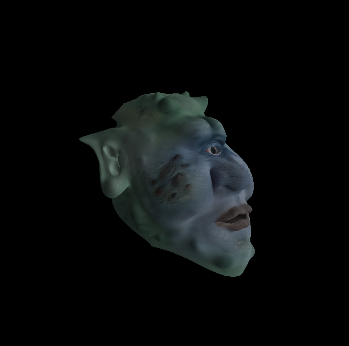

# Textures – TD7

Bastien Soucasse – M3D

## 1. Normal mapping sur un plan

Texture diffuse :

Carte des normales :

Perturbations de la normale :

Texture finale :

En appliquant une rotation sur l'objet, les normales ne sont pas recalculées. Elles sont donc déplacées avec l'objet mais pas réadaptées. En conséquence, les reflets sont très vite incohérents, et l'objet devient complètement noir pour une rotation de 180 degrés.

C'est encore plus visible sur un objet non planaire. En effet, il est considéré comme un plan et les courbures ne sont donc pas non plus prises en compte.

## 2. Calcul du repère tangent

Les calculs des tangentes et bitangentes par sommet ont été implémentés en se basant sur le travail effectué sur les normales, et en ajoutant l'ortho-normalisation de ces trois vecteurs ainsi que la re-normalisation. Ces deux vecteurs ont été passés au _Vertex Shader_ grâce à des entrées dédiées, en ajoutant tout d'abord à la structure **Vertex** deux attributs dédiés et en implémentant la transmission aux _Shaders_ dans **Mesh::draw()**.

## 3. Normal mapping sur une sphère

Après transfert des vecteurs du _Vertex Shader_ au _Fragment Shader_, ainsi qu'implémentation et utilisation de la matrice de transformation du repère _Model_ au repère _View_, on peut visualiser.

On peut se rendre compte que le rendu est très sombre (à moins que l'on pivote la vue — ce qui n'est pas censé impacter le résultat de cette manière — et en plus cela devient très clair au contraire). En se basant plutôt sur le cours (appliquer la matrice `tbn` à la normale plutôt qu'aux directions de vue et lumière), on constate qu'on a un rendu déjà un peu plus sombre de la réalité même s'il est toujours un peu sombre.

