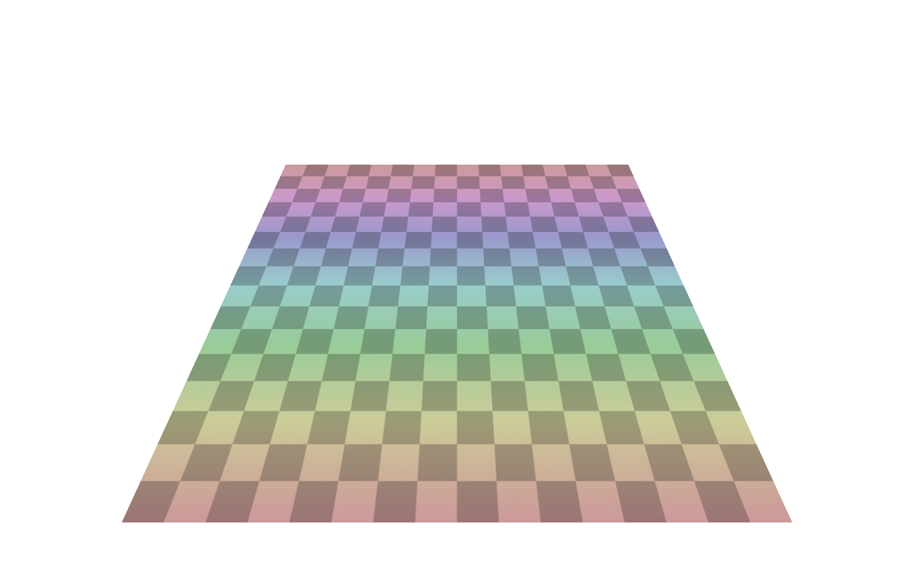
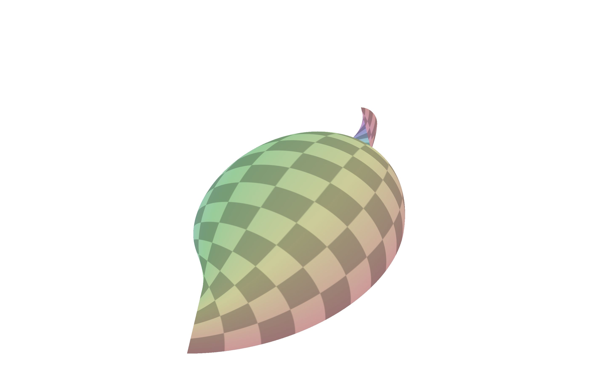
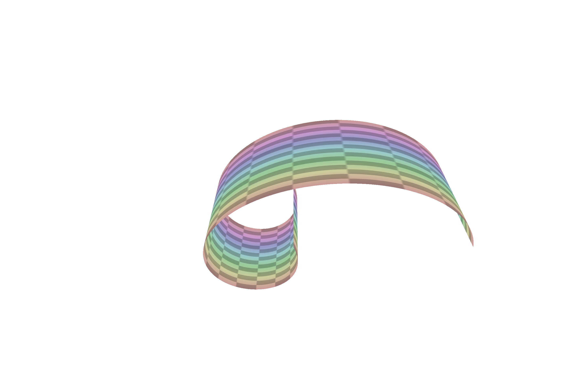
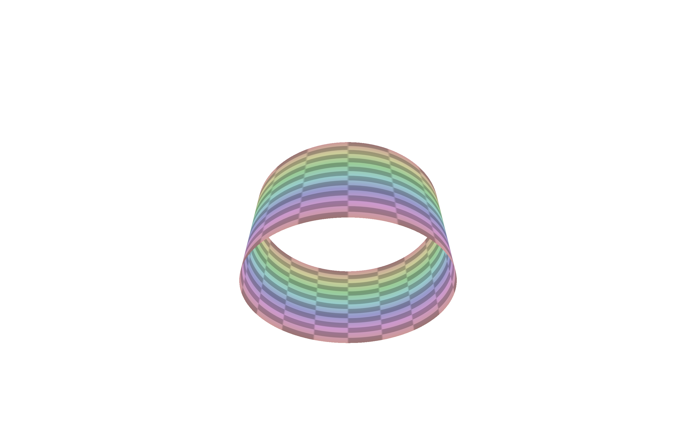
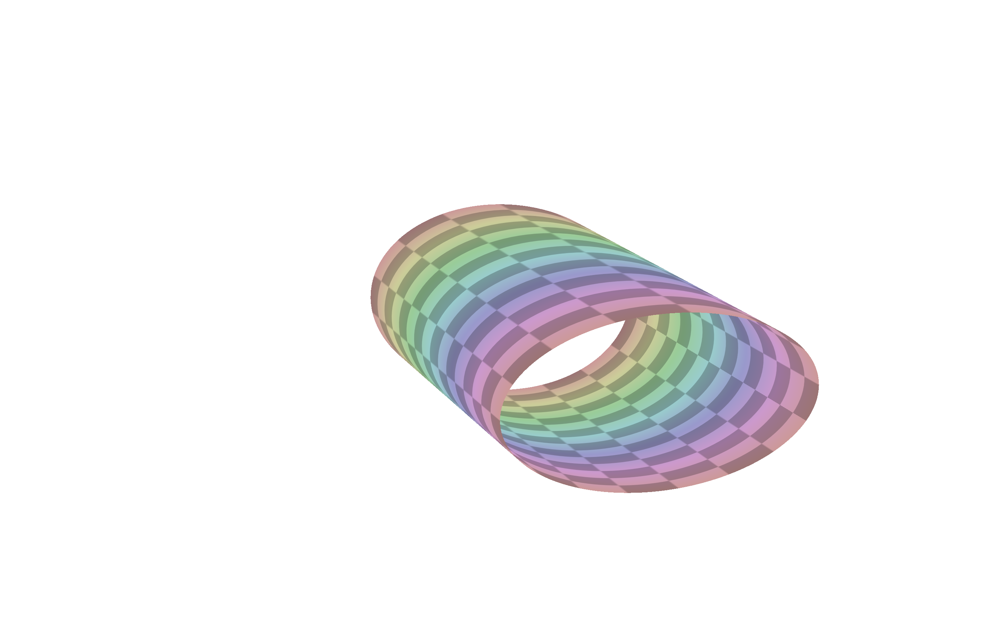
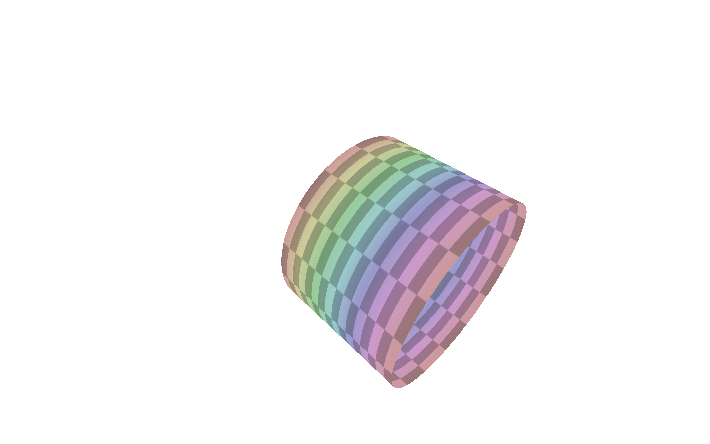

# Courbes et surfaces paramétriques – TD 8

Bastien Soucasse – M3D

## 1. Grille régulière

Pour la séance de TP, on utilise directement la maillage `grid.obj`.



## 2. Cylindre

### 2.1. Cylindre de base

```glsl
return r * vec3(cos(v), sin(v), u)
```

En appliquant cette formule, le rendu n'est pas le cylindre attendu, mais plutôt un coquillage étrange.



Effectivement, il y avait une erreur de _remapping_ de `u` et `v` : \[…\].

Après modification, on peut visualiser à nouveau une forme étrange mais qui se rapproche.



Il s'agissait d'une erreur du choix du centre. En effet, on utilisait `vtx_position` plutôt que l'origine. En corrigeant, on arrive finalement à un cylindre ouvert.



### 2.2. Cylindre orienté

```glsl
vec3 q = (1 - u) * A + u * B;
return q + r * vec3(cos(v), sin(v), 0);
```

En appliquant cette formule, on obtient un cylindre orienté dont les bases ne sont pas orthogonales, comme prévu.



### 2.3. Cylindre final

```glsl
vec3 t = normalize(B - A);
vec3 b = normalize(cross(t, vec3(1, 1, 1)));
vec3 n = normalize(cross(t, b));
mat3 bnt = mat3(b, n, t);

vec3 q = (1 - u) * A + u * B;
return q + bnt * (r * vec3(cos(v), sin(v), 0));
```

En appliquant cette formule, on obtient un cylindre final qui suit le segment _AB_.



## 3. Courbes de Bézier
