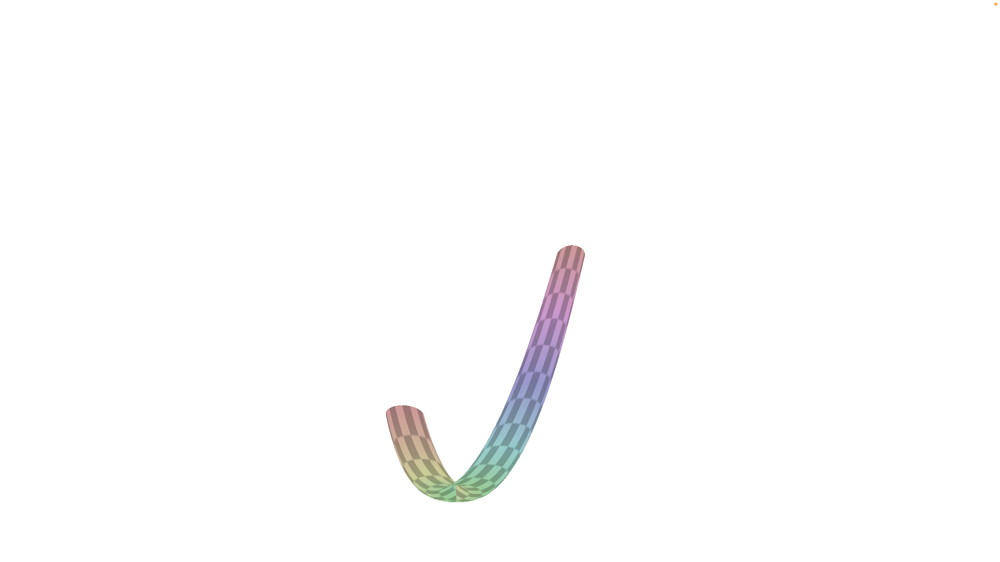
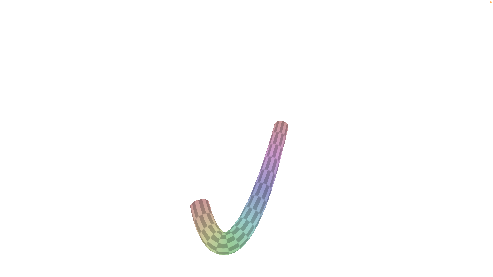
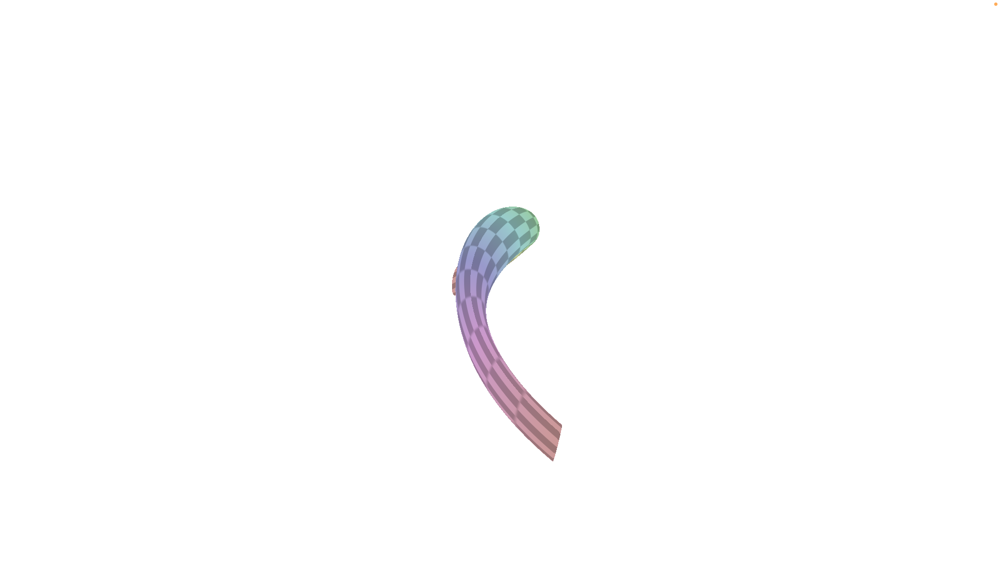
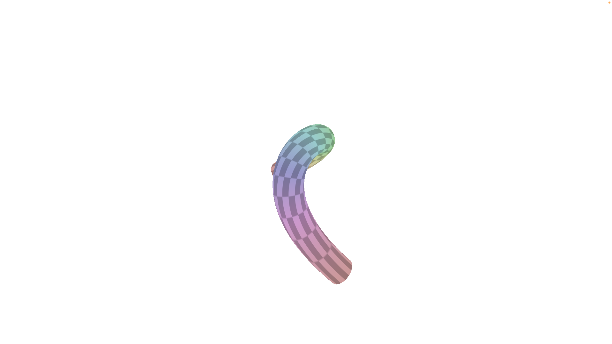
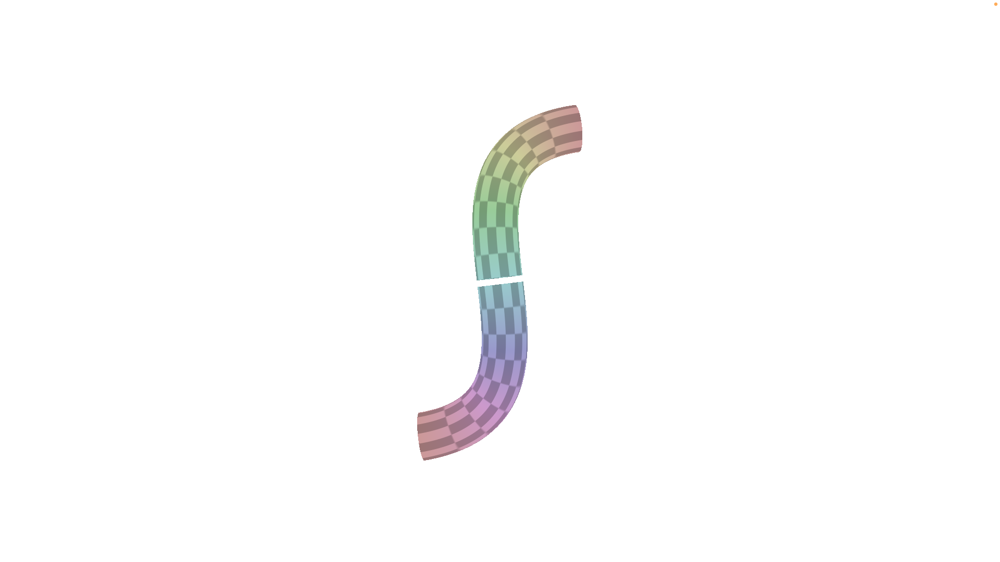
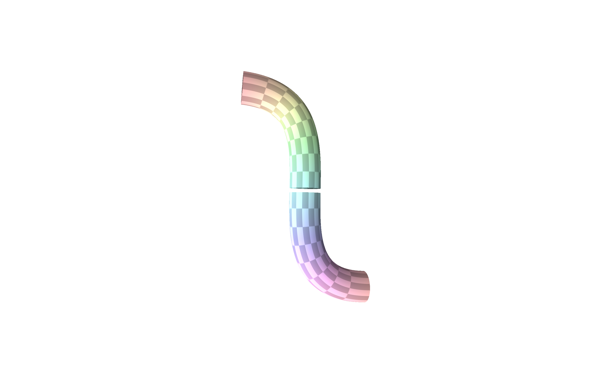
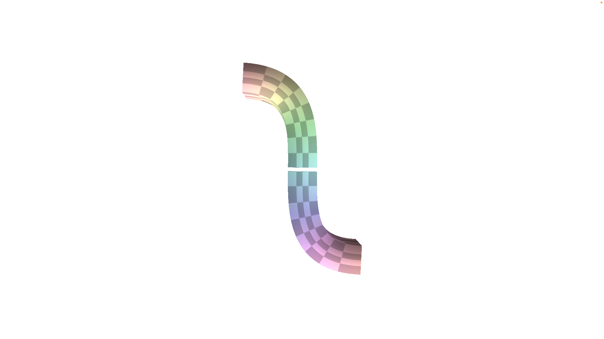
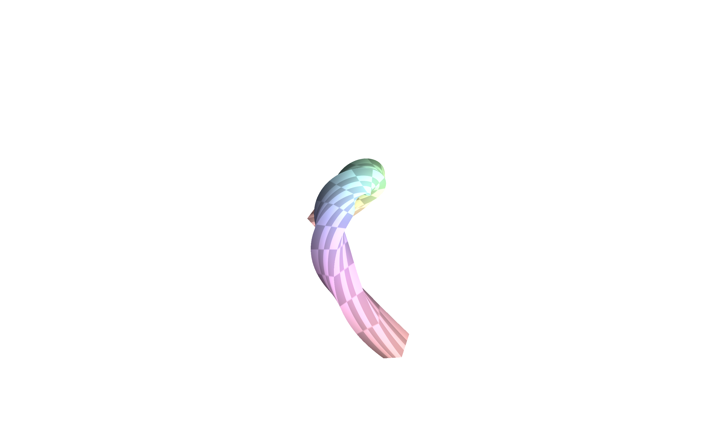

# Courbes et surfaces paramétriques – TD 8

Bastien Soucasse – M3D

## 1. Grille régulière

Pour la séance de TP, on utilise directement le maillage `grid.obj`. En écrivant la méthode `Mesh::createMesh()`, la grille est bien crée aux bonnes dimensions cependant la texture n'est pas appliquée et tout le travail suivant n'est pas visible. Je reste donc sur le maillage `grid.obj`.


## 2. Cylindre

### 2.1. Cylindre de base

```glsl
return r * vec3(cos(v), sin(v), u)
```

En appliquant cette formule, le rendu n'est pas le cylindre attendu, mais plutôt un coquillage étrange.


Effectivement, il y avait une erreur de _remapping_ de `u` et `v`.

Après modification, on peut visualiser à nouveau une forme étrange mais qui se rapproche.


Il s'agissait d'une erreur du choix du centre. En effet, on utilisait `vtx_position` plutôt que l'origine. En corrigeant, on arrive finalement à un cylindre ouvert.


### 2.2. Cylindre orienté

```glsl
vec3 q = (1 - u) * A + u * B;
return q + r * vec3(cos(v), sin(v), 0);
```

En appliquant cette formule, on obtient un cylindre orienté dont les bases ne sont pas orthogonales, comme prévu.


### 2.3. Cylindre final

```glsl
vec3 t = normalize(B - A);
vec3 b = normalize(cross(t, vec3(1, 1, 1)));
vec3 n = normalize(cross(t, b));
mat3 bnt = mat3(b, n, t);

vec3 q = (1 - u) * A + u * B;
return q + bnt * (r * vec3(cos(v), sin(v), 0));
```

En appliquant cette formule, on obtient un cylindre final qui suit le segment _AB_.


## 3. Courbes de Bézier

La première étape fût d'implémenter une première version des fonctions `bezier()` et `cylBezierYZ()`. En se basant sur le travail effectué précedemment, il fut relativement aisé d'implémenter `cylBezierYZ()` pour extruder un cercle autour de la courbe à la position renvoyée par `bezier()`. Pour implémenter `bezier()`, il fût nécessaire de bien appréhender les courbes de Bézier. Dans un premier temps, l'implémentation a été faite à l'aide des formules brutes. Après quoi, l'algorithme de De Casteljau a été utilisé. Ce point fût plus long et complexe a être implémenté. Finalement, le résultat obtenu a été le même dans les deux cas, la version avec l'algorithme a été conservée car elle est préférable.



La deuxième étape fût d'implémenter le calcul de la tangeante. Pour cela, je suis d'abord passé par les équations brutes comme précédemment, pour avoir un aperçu du résultat. Ensuite, l'utilisation de l'algorithme de De Casteljau a nécessité une attention particulière. En effet, il ne fût pas facile de comprendre comment récupérer la dérivée de `p` à partir de cet algorithme. Après beaucoup de réflexion sur papier, j'ai compris qu'il s'agissait en fait du vecteur produit pas la projection des points de contrôle de degré 2 (un seul segment).



Cependant, en testant ce code sur une courbe 3D, on se rend compte que le calcul est incorrect et le résultat invalide.



La troisième étape fût d'implémenter le calcul du repère de Frenet complet. De nouveau, une première version fût codée avec les formules brutes, avant de passer à une implémentation avec l'algorithme de De Casteljau.



En testant avec le troisième ensemble de points, on retrouve un trou dans la forme.



La torsion fût un problème à implémenter. J'ai décidé de l'implémenter plus tard.

J'ai donc commencé par implémenter le calcul des normales en faisant la position du point à la surface moins celle du point sur la courbe pour avec le vecteur que l'on peut ensuite normaliser.



Ensuite, la section carrée a été appliquée pour la visualisation de la torsion à appliquer par la suite, en normalisant le cercle par sa norme infinie.



Finalement, après courte discussion avec vous-même (si vous êtes bien M. Guennebaud), il a été déterminé qu'il fallait appliquer une matrice de rotation d'un angle dépendant de `u`. Le contrôle au clavier du coefficient de torsion a été également implémenté comme dans les TD précédents.

- Coefficient de torsion de 0 :

    

- Coefficient de torsion de 1 :

    

- Coefficient de torsion de 2 :

    
