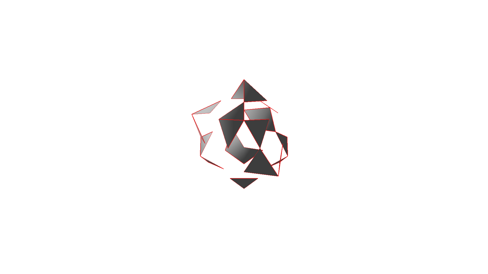

# TD9 — Surfaces de subdivision

## Subdivision basique

Après avoir calculé la position des sommets nouvellement ajoutés, il est possible de créer des faces (triangles) avec les nouveaux sommets et les anciens (pas encore repositionnés).

Il est alors dores et déjà possible de constater des erreurs. Le problème ne semble pas venir des sommets ajoutés à première vue, mais de la création des faces.

En affichant chaque sous-face une à une, on peut commencer à localiser la source du problème. Il s'agit effectivement d'une mauvaise initialisation des faces.

En éditant l'ordre des sommets, on parvient finalement au résultat attendu.

Il est alors possible d'implémenter le calcul de la position des sommets initiaux.

## Gestion des bords

L'implémentation de la gestion des bords a d'abord témoigné d'un problème de calcul des position des sommets.

Après de longues recherches, il s'est avéré que ma méthode de parcours des voisins d'un sommet (pour calculer la nouvelle position d'un sommet existant) était erronée, et que cela n'était visible que pour les cas des bords. Cependant, après mise à jour, le résultat fut celui attendu.

